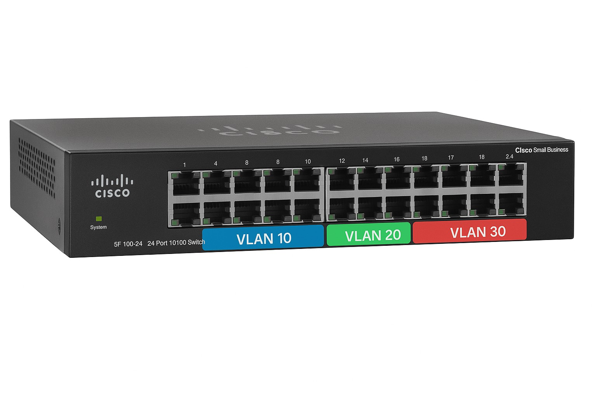
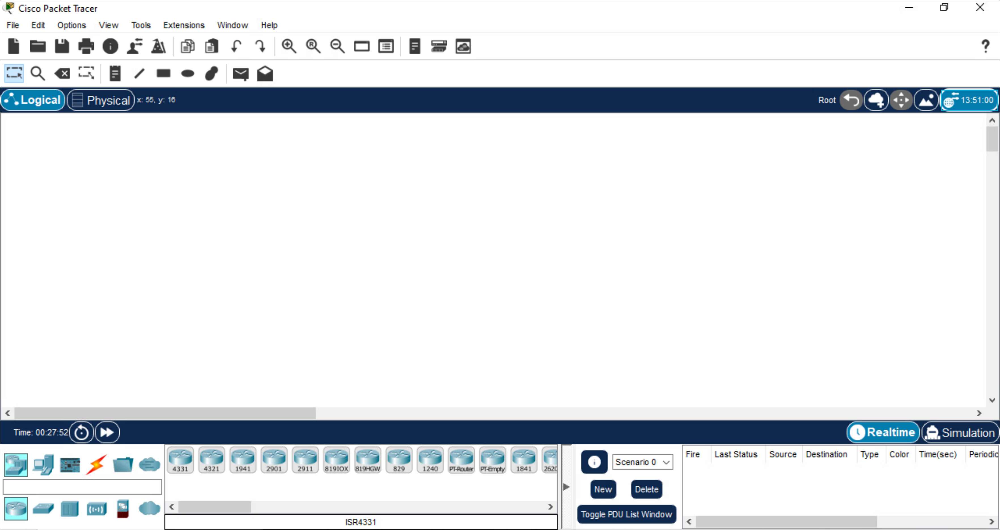
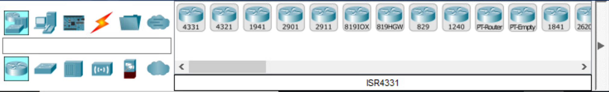
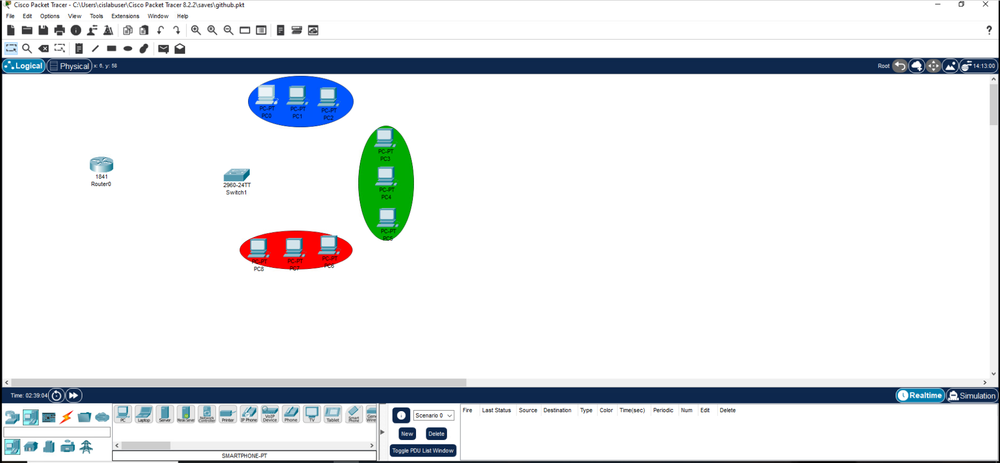
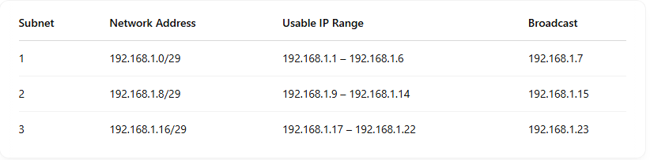

# VLANs

## Overview:

**A VLAN (Virtual Local Area Network)** is a logical grouping of devices on a network, designed to create separate broadcast domains without requiring separate physical networks.

- **Purpose:**

VLANs help segment a larger network into smaller, isolated groups, which enhances security, reduces congestion by limiting broadcast traffic, and simplifies network management.

- **How It Works:**

Even if devices are connected to the same physical switch, assigning them to different VLANs means they “live” in different network spaces. This logical separation ensures that broadcast traffic stays within each VLAN.

- **Benefits:**
   - **Improved Security:** Limits the spread of sensitive information and isolates potential threats.
   - **Efficient Traffic Management:** Reduces network congestion by confining broadcast traffic.
   - **Simplified Administration:** Enables easier network reconfiguration and management without physical changes.

- Implementation:
VLANs are typically implemented using managed switches that support VLAN configuration. Traffic between VLANs (when necessary) is handled by a router or a Layer 3 switch through a process known as inter-VLAN routing.

 ## Network Environment

You're building a VLAN-based network in Cisco Packet Tracer.
click on the link below to download packet tracer. If you do not have a account, you will need to create one and if you get lost after you create your account you can still come back here for redirection or short path.

link: https://www.netacad.com/resources/lab-downloads?courseLang=en-US

## Network Hardware

🖧 Devices

- 1 Router – Handles inter-VLAN routing using Router-on-a-Stick.

- 1 24-Port Switch – Connects all devices and assigns VLANs.

- 9 PCs – Divided into 3 VLANs (3 PCs per VLAN).

- 9 cooper straigh-through for each PC'S. 

## BUILDING THE ENVIRONMENT.

After download and create your account you are supose to see the image below.

click and drop all devices nedeed from this section of the packet tracer.

Once you have finish to drop all the devices make sure to regroup all your devices by group of 3 PC as PC/0,PC/1, and PC/2 are in the same area and vise versa. So all group of PC represente different department of a company's network. I just choose paint it in diferrent colors Bleu for VLan 10, Green for VLan 20, and Red for VLan 30. See the image below for referral.  

for coloring here is a video link of few second to learn how to do it: https://www.youtube.com/shorts/cm1KDcYKnCs

🧩 IP and Interfaces Configuration

In this image we have three diffrent network address / Default Gateway for each VLan, and three range of usable IP for each network / Default Gateway.

Since we only have three PC we will only use the first three usable IP of each network 

Now we have to isolate each group / VLan  of PC on 3 diferent network/Default Gateway. 

- VLAN 10 – Assigned to the first 3 PCs.
     - Default Gateway: 192.168.1.0/29
     - PC0/IP: 192.168.1.1
     - PC1/IP: 192.168.1.2
     - PC2/IP: 192.168.1.3

Click on the PC/0 the this image below should appear in your screen.

Then CLick on the option that says IP Configuration the image should appear in your screen.

Next we will configure an static IP To PC/0 by choosing the option Static 

      
- VLAN 20 – Assigned to the next 3 PCs.
  - Default Gateway: 192.168.1.8/29
  - PC3/IP: 192.168.1.9
  - PC4/IP: 192.168.1.10
  - PC5/IP: 192.168.1.11

- VLAN 30 – Assigned to the last 3 PCs.
  - Default Gateway: 192.168.1.16/29
  - PC6/IP: 192.168.1.17
  - PC7/IP: 192.168.1.18
  - PC8/IP: 192.168.1.19

I placed notes on my packet tracer interface to not get lost in the process
    

Each group is isolated at Layer 2 but will be able to communicate through the router.

### 🔁 Trunking
A trunk link is configured between the switch and router (e.g., Switch fa0/1 to Router g0/0).

This trunk carries traffic for all VLANs, using 802.1Q tagging.

The router uses sub-interfaces (like g0/0.10, g0/0.20, g0/0.30) for each VLAN and handles inter-VLAN routing.

🔗 Connectivity
PCs connect to the switch via access ports assigned to their respective VLANs.

The switch forwards traffic to the router through the trunk port.

The router processes and routes traffic between VLANs as needed.

🎯 Purpose
Demonstrate VLAN segmentation to separate traffic.

Enable inter-VLAN routing using a single physical router interface (Router-on-a-Stick).

Practice switchport configuration, VLAN setup, trunking, and basic IP addressing.

