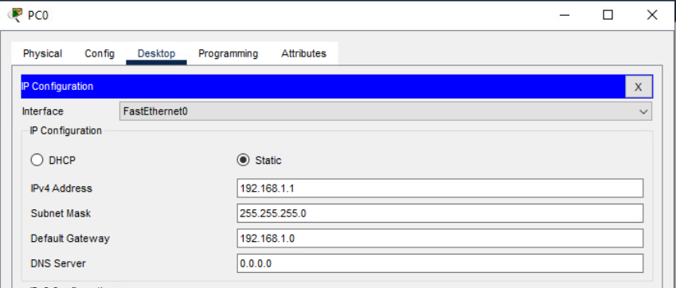

# VLANs

## Overview:

**A VLAN (Virtual Local Area Network)** is a logical grouping of devices on a network, each grouping of devices on the same network sharing a switch with more network are VLan  designed to create separate broadcast domains without requiring separate physical networks.

- **Purpose:**

VLANs help segment a larger network into smaller, isolated groups, which enhances security, reduces congestion by limiting broadcast traffic, and simplifies network management.

- **How It Works:**

Even if devices are connected to the same physical switch, assigning them to different VLANs means they “live” in different network spaces. This logical separation ensures that broadcast traffic stays within each VLAN.

- **Benefits:**
   - **Improved Security:** Limits the spread of sensitive information and isolates potential threats.
   - **Efficient Traffic Management:** Reduces network congestion by confining broadcast traffic.
   - **Simplified Administration:** Enables easier network reconfiguration and management without physical changes.

- Implementation:
VLANs are typically implemented using managed switches that support VLAN configuration. Traffic between VLANs (when necessary) is handled by a router or a Layer 3 switch through a process known as inter-VLAN routing.

 ## Network Environment

You're building a VLAN-based network in Cisco Packet Tracer.
click on the link below to download packet tracer. If you do not have a account, you will need to create one and if you get lost after you create your account you can still come back here for redirection or short path.

link: https://www.netacad.com/resources/lab-downloads?courseLang=en-US

### Network Hardware

🖧 Devices

- 1 Router – Handles inter-VLAN routing using Router-on-a-Stick.

- 1 24-Port Switch – Connects all devices and assigns VLANs.

- 9 PCs – Divided into 3 VLANs (3 PCs per VLAN).

- 9 cooper straigh-through for each PC'S. 

### BUILDING THE ENVIRONMENT.

After download and create your account you are supose to see the image below.

click and drop all devices nedeed from this section of the packet tracer.

Once you have finish to drop all the devices make sure to regroup all your devices by group / VLan of 3 PC as PC/0,PC/1, and PC/2 in the same departement or group / VLan 10 and so on. So all group of PC represente different department of a company's networks. I just choose paint it in diferrent colors to disguste, Bleu for VLan 10, Green for VLan 20, and Red for VLan 30. See the image below for referral.  

for coloring here is a video link of few second to learn how to do it: https://www.youtube.com/shorts/cm1KDcYKnCs

🧩 IP and Interfaces Configuration

In this image below we have three diffrent network address / Default Gateway for each VLan, and three usable range of IP for each network / Default Gateway.

In this image below is my setup, i placed a note in my packet tracer for not getting lost in the process. if you see, in my notes i also assigned interface for each PC for further configuration, it helps too.

link for placing note : https://www.youtube.com/watch?v=80WqvU-xKjc

Now that we have set up the environment and we also have three different networks we good to start the IP configuration for each PC.

Since we only have three PC in each grouping / VLan we will only use the first three usable IP of each network address / Default Gateway.

Now we have to isolate each group / VLan  of PC in 3 diferent network / Default Gateway. 

- VLAN 10 – Assigned to the first 3 PCs.
     - Default Gateway: 192.168.1.0/29
     - PC0/IP: 192.168.1.1 / PC0 interface : fa0/1
     - PC1/IP: 192.168.1.2 / PC1 interface : fa0/2
     - PC2/IP: 192.168.1.3 / PC2 interface : fa0/3

- VLAN 20 – Assigned to the next 3 PCs.
  - Default Gateway: 192.168.1.8/29
  - PC3/IP: 192.168.1.9 PC3 / interface : fa0/9
  - PC4/IP: 192.168.1.10 PC4 / interface : fa0/10
  - PC5/IP: 192.168.1.11 PC5 / interface : fa0/11

- VLAN 30 – Assigned to the last 3 PCs.
  - Default Gateway: 192.168.1.16/29
  - PC6/IP: 192.168.1.17 PC6 / interface : fa0/17
  - PC7/IP: 192.168.1.18 PC7 / interface : fa0/18
  - PC8/IP: 192.168.1.19  PC8 / interface : fa0/19

On Packet Tracer click on the PC/0, Then CLick on the option Desktop and choose IP Configuration  this image below should appear in your screen.

Next we will configure an static IP To PC/0 by clicking on the Static option and fill the IPV4 case by the assigned IP  for PC/0 that is PC0/IP : 192.168.1.1 and the Default Gateway case by network address / Default Gateway that is 192.168.1.0, for the Subnet Mask part, one left click will give you the Subnet Mask for this IP, that's it, you assigne an IP for PC/0 and an Default Gateway.

And last thing to do in the IP configuration for PC/0 it's to click on the cross case inside the blue layer that says IP Configuration to save.

⚠ Each PC need the same configuration.

## 🗂️ VLan Configuration

Now comes the fun part, configuring the VLAN! To do this, we’ll be working directly on the switch using its Command Line Interface (CLI).

First step it's to click on the Switch, and choose the option **CLI**. This image below should appear in your screen. 

### 🔁 Trunking
A trunk link is configured between the switch and router (e.g., Switch fa0/1 to Router g0/0).

This trunk carries traffic for all VLANs, using 802.1Q tagging.

The router uses sub-interfaces (like g0/0.10, g0/0.20, g0/0.30) for each VLAN and handles inter-VLAN routing.

🔗 Connectivity
PCs connect to the switch via access ports assigned to their respective VLANs.

The switch forwards traffic to the router through the trunk port.

The router processes and routes traffic between VLANs as needed.

🎯 Purpose
Demonstrate VLAN segmentation to separate traffic.

Enable inter-VLAN routing using a single physical router interface (Router-on-a-Stick).

Practice switchport configuration, VLAN setup, trunking, and basic IP addressing.

